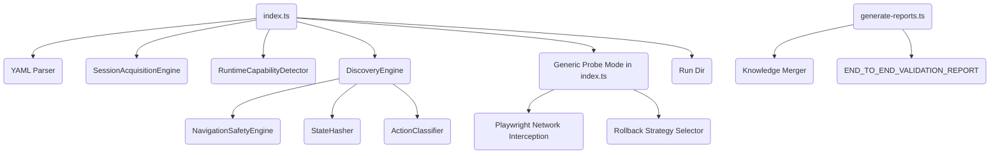

# Implementation Graph

## Dependency Classifications
- `apps/seeder/src/index.ts`: **ACTIVE**
- `apps/seeder/src/generate-reports.ts`: **ACTIVE**
- `apps/seeder/src/core/SessionManager.ts`: **ACTIVE**
- `apps/seeder/src/subsystems/discovery/DiscoveryEngine.ts`: **ACTIVE**
- `apps/seeder/src/subsystems/discovery/RuntimeCapabilityDetector.ts`: **ACTIVE**
- `apps/seeder/src/subsystems/discovery/StateHasher.ts`: **ACTIVE**
- `apps/seeder/src/subsystems/discovery/ActionClassifier.ts`: **ACTIVE**
- `apps/seeder/src/subsystems/session-acquisition/SessionAcquisitionEngine.ts`: **ACTIVE**
- `apps/seeder/src/subsystems/correlation/*`: **ORPHAN**
- `apps/seeder/src/subsystems/probe/*`: **ORPHAN**
